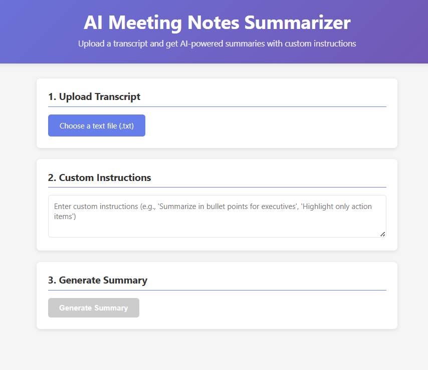

# AI Meeting Notes Summarizer  

A full-stack web application that leverages **AI** to automatically summarize meeting transcripts with **custom instructions** and **email sharing capabilities**.  

🌐 **Live Demo**: [AI Meeting Notes Summarizer](https://ai-meeting-summarizer-0hmv.onrender.com/)  

---

## 📸 Preview  

  

---

## 🚀 Features  

- **File Upload**: Upload plain text (`.txt`) transcript files (max 5MB)  
- **Custom Instructions**: Provide specific summarization prompts  
  _(e.g., "Summarize in bullet points for executives")_  
- **AI Summarization**: Powered by **Groq Cloud API (Llama 3.1 8B)**  
- **Editable Summaries**: Review and refine AI-generated summaries  
- **Email Sharing**: Send summaries to multiple recipients via Gmail SMTP  
- **Responsive Design**: Works seamlessly on desktop & mobile  

---

## 🛠 Tech Stack  

**Frontend**  
- React.js (functional components, hooks)  
- Axios (API calls)  
- Custom CSS (responsive design)  

**Backend**  
- Node.js (v18+), Express.js  
- Multer (file upload handling)  
- Nodemailer (email service)  
- dotenv (environment variables)  

**AI**  
- Groq Cloud API (Llama 3.1 8B model)  

**Dev Tools**  
- npm, nodemon, CORS, error middleware  

---

## 📋 Prerequisites  

- Node.js v14+  
- npm or yarn  
- **Groq Cloud API Key** → [Get from Groq Console](https://console.groq.com/)  
- Gmail account with **App Password** enabled  

---

## ⚡ Quick Start  

### 1. Clone & Install  
```bash
git clone https://github.com/shivam999876/ai-meeting-notes-summarizer.git
cd ai-meeting-notes-summarizer

# Backend
npm install

# Frontend
cd client
npm install

### 2. Setup Environment Variables  

Create a **.env** file in the root directory with the following variables:  

```env
# Backend server port
PORT=5000  

# Groq API key (get it from https://console.groq.com/)
GROQ_API_KEY=your_groq_api_key_here  

# Gmail SMTP credentials
EMAIL_USER=your_gmail@example.com  
EMAIL_PASS=your_gmail_app_password  

cd client
npm install
